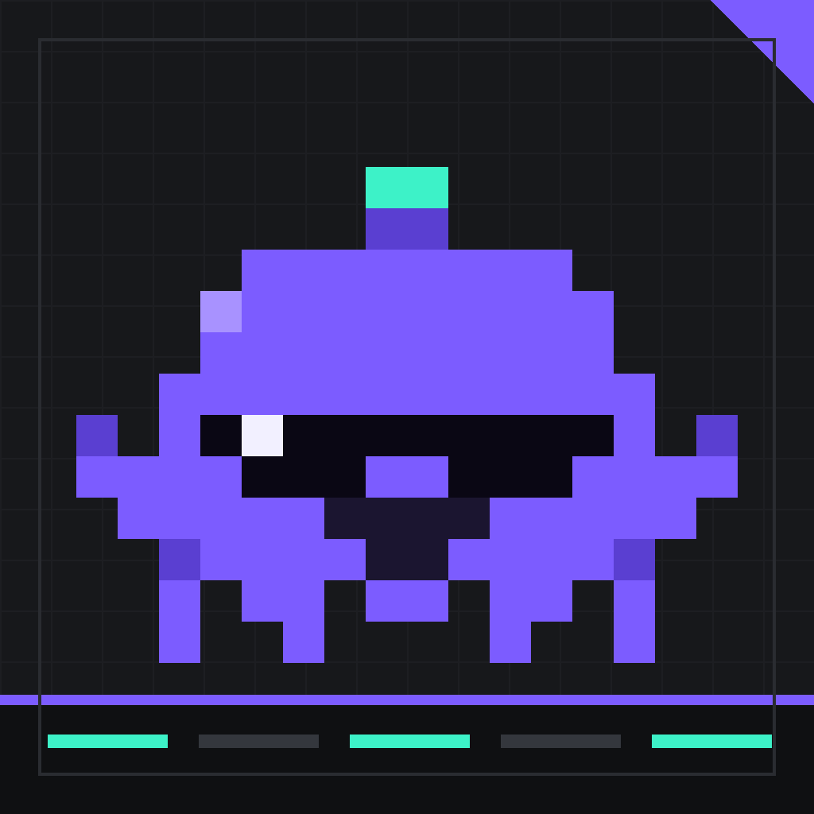
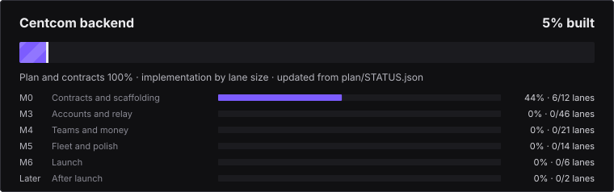

# Centcom Backend

<p align="left"></p>

Private server side of Centcom: REST API, WebSocket relay, workers, billing, notifications, infrastructure.

> Status: planning complete and the contracts are frozen and locked; implementation has not started (gate **G0** also needs the CI lane B002). See [Progress](#progress) for what is next. Everything you need is in [`plan/`](plan/README.md) and [`contracts/`](contracts/README.md).


## Website and documentation

The public sales site and the full documentation live in [`site/`](site/README.md): static, no build tooling beyond `python3 site/build.py`. Built by Caffeine Driven LLC.

<!-- progress:start -->

## Progress



**4% built** (weighted by lane size across 101 lanes). Details and how this is computed: [`tools/plan/progress.py`](tools/plan/progress.py). Update [`plan/STATUS.json`](plan/STATUS.json) when you finish or advance a lane, then run `python3 tools/plan/progress.py`.

## Next steps

1. **B001 monorepo scaffold, then B002 CI and B003 contract codegen** — the contracts are frozen and locked, so the backend can start; nothing is built yet and these three unblock everything else (gate G0 also needs B002's CI)
2. **B004-B006 config, logging and the error layer** — every later lane uses them; keep the problem+json shape from contracts/ exactly
3. **B007 database package and B008 core schema v1, with B009 Redis abstraction** — identity, sessions and the relay all sit on these
4. **B011 mock client simulator and B012 one-command local environment** — lets the relay lanes be tested without the client repo (you only ever meet the client at contracts/)
5. **B016 device authorization grant and B017 token service** — the terminal client's `centcom login` needs these first (client lane C052)
6. **Relay lanes (see plan/ROADMAP.md M2-M3)** — the backend should be ready by the time the client reaches M3; start the relay while identity is in review

### Ready to pick up (all dependencies done)

| Lane | What | Size | Milestone |
|---|---|---|---|
| [B005](plan/backend/B005.md) | Structured logging, request ids, redaction | S | M0 |
| [B007](plan/backend/B007.md) | Database package: Postgres client, migration runner, conventions | M | M0 |
| [B009](plan/backend/B009.md) | Redis abstraction: pub/sub, KV, rate-limit primitives (in-memory + Redis impls) | M | M0 |
| [B091](plan/backend/B091.md) | Infrastructure as code: environments dev, stage, prod | L | M3 |
| [B097](plan/backend/B097.md) | Security hardening: headers, WAF rules, secret scanning, dependency policy | M | M6 |

Each lane card lists its goal, contracts, acceptance criteria and tests. Read [`plan/START_HERE.md`](plan/START_HERE.md) first.

<!-- progress:end -->

## What this repo will contain

```
apps/api       Fastify REST API (/v1/*)
apps/relay     WebSocket relay (sessions, sequencing, queue, presence, control)
apps/worker    BullMQ jobs (webhooks, notifications, billing, retention)
apps/admin     Internal admin console
packages/      contracts (generated), core, db, testkit
infra/         Terraform, Fly.io, runbooks, load and chaos tests
```

The relay is deliberately blind: it routes **ciphertext** and may read only the cleartext metadata listed in `contracts/04-session-events.md`.

## The plan

- **[101 backend lanes (B001-B101)](plan/backend/README.md)**: independent tasks with strict acceptance criteria.
- **Start with [`plan/START_HERE.md`](plan/START_HERE.md), then [`plan/ROADMAP.md`](plan/ROADMAP.md) and [`plan/FEATURES.md`](plan/FEATURES.md).**
- [Architecture and decisions](plan/ARCHITECTURE.md) · [strict guidelines](plan/GUIDELINES.md) · [dependency graph](plan/GRAPH.md) · [contract matrix](plan/CONTRACT_MATRIX.md) · [integration gates](plan/INTEGRATION.md).
- The client repo (`Centcom`) has its own 105 lanes. **You never depend on them**; you meet only at [contracts](contracts/README.md). Build against the mock client simulator (lane B011); prove compatibility with the conformance suite (lane B100).

## Day one

```bash
python3 tools/plan/validate_contracts.py   # gate G0 checks
python3 tools/plan/validate_plan.py        # plan consistency
python3 tools/plan/lock.py --check         # contracts unchanged
```
Then pick a lane from layer 1 of [`plan/GRAPH.md`](plan/GRAPH.md) (start: **B001**), open its card, and follow [`plan/GUIDELINES.md`](plan/GUIDELINES.md).

## Source of truth

`contracts/`, `plan/` and `tools/plan/` are identical in both repos. Do not edit them here except through the Contract PR process (`plan/GUIDELINES.md` §9). Verify parity with:
`python3 tools/plan/lock.py --compare ../Centcom/contracts`
