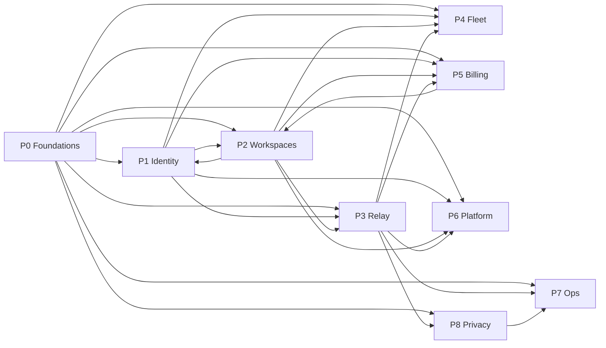
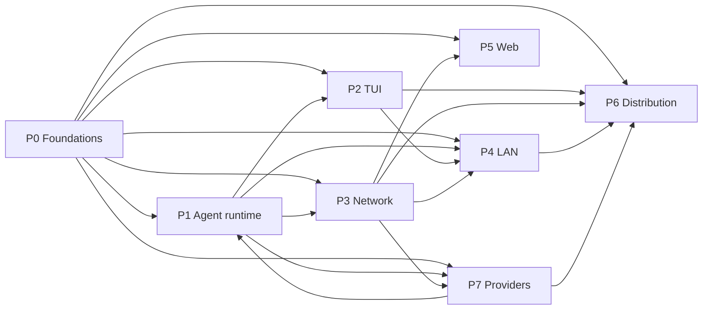

# Dependency graph

Generated by `tools/plan/build_plan.py`. Layer N can start once everything in earlier layers it depends on is done; lanes in the same layer never depend on each other.

## Backend

Critical path: **45 days** → B001 → B004 → B007 → B008 → B013 → B017 → B038 → B040 → B041 → B044 → B045 → B095 → B096

Serial effort: 285 person-days. With enough people the plan can finish in about the critical-path length; with N people expect roughly max(critical path, 285/N) days.

| Layer | Lanes (can run in parallel) |
|---:|---|
| 1 | B001 |
| 2 | B002, B003, B004, B091 |
| 3 | B005, B007, B009, B092, B097 |
| 4 | B006, B008, B010, B037, B098, B099 |
| 5 | B011, B012, B013, B021, B023, B024, B025, B032, B036, B039, B069, B084, B085, B086, B093 |
| 6 | B014, B015, B017, B022, B026, B027, B055, B063, B080, B081, B082, B087, B094 |
| 7 | B016, B018, B019, B020, B028, B034, B035, B038, B056, B064, B065, B070, B074, B083, B088, B090 |
| 8 | B029, B030, B031, B040, B043, B066, B071, B072, B075, B079 |
| 9 | B033, B041, B047, B053, B073, B077 |
| 10 | B042, B044, B048, B054, B067, B078 |
| 11 | B045, B046, B049, B051, B052, B057, B059, B062, B068, B076, B089 |
| 12 | B050, B058, B060, B061, B095 |
| 13 | B096, B101 |
| 14 | B100 |

## Client

Critical path: **37 days** → C001 → C003 → C007 → C054 → C072 → C074 → C075 → C076 → C100

Serial effort: 299 person-days. With enough people the plan can finish in about the critical-path length; with N people expect roughly max(critical path, 299/N) days.

| Layer | Lanes (can run in parallel) |
|---:|---|
| 1 | C001 |
| 2 | C002, C003, C004, C009, C031 |
| 3 | C005, C007, C008, C010, C012, C025, C032, C056, C071, C081, C099 |
| 4 | C006, C011, C033, C034, C073, C086, C092, C094, C097, C101 |
| 5 | C013, C035, C036, C039, C040, C043, C044, C051, C054, C104 |
| 6 | C014, C015, C017, C019, C020, C021, C023, C026, C028, C030, C037, C041, C045, C050, C052, C055, C057, C064, C066, C067, C068, C069, C070, C072, C082, C087, C098 |
| 7 | C016, C018, C022, C024, C027, C029, C038, C042, C046, C047, C053, C058, C059, C060, C061, C063, C074, C083, C088, C089, C090, C091, C095, C102, C103, C105 |
| 8 | C048, C049, C062, C065, C075, C077, C085, C093 |
| 9 | C076, C078, C080, C084, C096 |
| 10 | C079, C100 |

